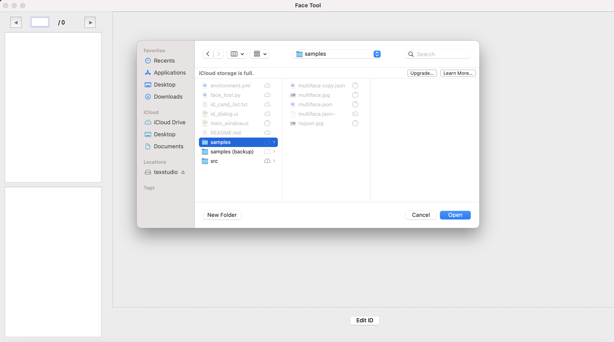

# Face Tool

Face Tool provides a convenient GUI for non-tech users to draw bounding boxes around faces in the image.

## Load Image

## Initial Result

## Modified Result

### Functions
1) Adjust size of the bounding boxes
2) Add new bounding boxes with label from id_cand_list.txt
3) Delete unnecessary bounding boxes
4) Read/write image information from the json file

### Requirement
- Linux & MacOS
- Anaconda
- `conda env create -f environment.yml`

